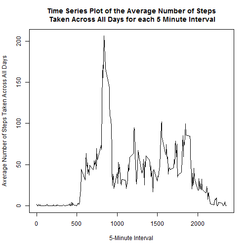

# Reproducible Research: Peer Assessment 1
Further instructions can be found at the Coursera site https://class.coursera.org/repdata-013

## Loading and preprocessing the data
### Assumptions
 - The working directory is set to this current project folder.
 - This current project folder contains the downloaded activity.zip file. 

Load the activity data into a data frame.

```r
if(!file.exists('activity.csv')){
    unzip('activity.zip')
}
dfActivity <- read.csv('activity.csv', stringsAsFactors = FALSE, na.strings = "NA")
```

The data is made up of the following fields.

```r
names(dfActivity)
```

```
## [1] "steps"    "date"     "interval"
```

```r
str(dfActivity)
```

```
## 'data.frame':	17568 obs. of  3 variables:
##  $ steps   : int  NA NA NA NA NA NA NA NA NA NA ...
##  $ date    : chr  "2012-10-01" "2012-10-01" "2012-10-01" "2012-10-01" ...
##  $ interval: int  0 5 10 15 20 25 30 35 40 45 ...
```

```r
head(dfActivity, 10)
```

```
##    steps       date interval
## 1     NA 2012-10-01        0
## 2     NA 2012-10-01        5
## 3     NA 2012-10-01       10
## 4     NA 2012-10-01       15
## 5     NA 2012-10-01       20
## 6     NA 2012-10-01       25
## 7     NA 2012-10-01       30
## 8     NA 2012-10-01       35
## 9     NA 2012-10-01       40
## 10    NA 2012-10-01       45
```

## What is mean total number of steps taken per day?
For this part of the assignment, we ignore the missing values in the dataset.

### 1. Calculate the total number of steps taken per day, and show some of the aggregated data.

```r
dfAggActivity <- aggregate(steps ~ date, dfActivity, sum, na.rm = TRUE)

# Change to descriptive variable names.
names(dfAggActivity)[2] <- "sum_steps"

# Show some of the aggregated data.
head(dfAggActivity)
```

```
##         date sum_steps
## 1 2012-10-02       126
## 2 2012-10-03     11352
## 3 2012-10-04     12116
## 4 2012-10-05     13294
## 5 2012-10-06     15420
## 6 2012-10-07     11015
```

### 2. Make a histogram of the total number of steps taken each day.
Please note that this is NOT a bar plot of the total steps taken for each date but rather a histogram (i.e., frequency count) of the total steps taken per day, each histogram represents a group of 20 steps (i.e., of 0-20, 21-40, 41-60, ...).

```r
hist(
      dfAggActivity$sum_steps,
      col = "red",
      main = "Histogram of the Total Steps Per Day",
      xlab = "Total Steps Per Day",
      breaks = 20
      )
```

 

### 3. Calculate and report the mean and median of the total number of steps taken per day

```r
# Mean
mean(dfAggActivity$sum_steps)
```

```
## [1] 10766.19
```

```r
# Median
median(dfAggActivity$sum_steps)
```

```
## [1] 10765
```

## What is the average daily activity pattern?

### 1. Make a time series plot (i.e. type = "l") of the 5-minute interval (x-axis) and the average number of steps taken, averaged across all days (y-axis)

```r
## Calculate the average number of steps taken for each 5-minute interval across all days.
dfInterval <- aggregate(steps ~ interval, dfActivity, mean, na.rm = TRUE)

## Add descriptive variable names.
names(dfInterval)[2] <- "mean_steps"

## Show the new data frame.
head(dfInterval, 5)
```

```
##   interval mean_steps
## 1        0  1.7169811
## 2        5  0.3396226
## 3       10  0.1320755
## 4       15  0.1509434
## 5       20  0.0754717
```

```r
## Plot the time series
plot(
        x = dfInterval$interval,
        y = dfInterval$mean_steps,
        type = "l",
        main = "Time Series Plot of the Average Number of Steps\n Taken Across All Days for each 5 Minute Interval",
        xlab = "5-Minute Interval",
        ylab = "Average Number of Steps Taken Across All Days"
)
```

 

### 2. Which 5-minute interval, on average across all the days in the dataset, contains the maximum number of steps?

```r
dfInterval[dfInterval$mean_steps==max(dfInterval$mean_steps),]
```

```
##     interval mean_steps
## 104      835   206.1698
```
From the above, the interval 0835 is the time when the maximum number of steps is taken (averaged across all days).

## Imputing missing values

### 1. Calculate and report the total number of missing values in the dataset (i.e. the total number of rows with NAs)

```r
nrow(dfActivity[is.na(dfActivity$steps),])
```

```
## [1] 2304
```

### 2. Devise a strategy for filling in all of the missing values in the dataset. The strategy does not need to be sophisticated. For example, you could use the mean/median for that day, or the mean for that 5-minute interval, etc.
For a given interval, let us use the mean of the interval to fill in the missing values for that interval.

### 3. Create a new dataset that is equal to the original dataset but with the missing data filled in.

```r
## merge original activity data frame with interval data frame
newdfActivity <- merge(dfActivity, dfInterval, by = 'interval', all.y = F)

## merge NA values with averages rounding up for integers
newdfActivity$steps[is.na(newdfActivity$steps)] <- as.integer(
        round(newdfActivity$mean_steps[is.na(newdfActivity$steps)]))

## drop and reorder columns to match original activity data frame
## http://stackoverflow.com/questions/4605206/drop-columns-r-data-frame
keeps <- names(dfActivity)
newdfActivity <- newdfActivity[keeps]

# Show the new data frame.
names(newdfActivity)
```

```
## [1] "steps"    "date"     "interval"
```

```r
str(newdfActivity)
```

```
## 'data.frame':	17568 obs. of  3 variables:
##  $ steps   : int  2 0 0 0 0 0 0 0 0 0 ...
##  $ date    : chr  "2012-10-01" "2012-11-23" "2012-10-28" "2012-11-06" ...
##  $ interval: int  0 0 0 0 0 0 0 0 0 0 ...
```

```r
head(newdfActivity, 10)
```

```
##    steps       date interval
## 1      2 2012-10-01        0
## 2      0 2012-11-23        0
## 3      0 2012-10-28        0
## 4      0 2012-11-06        0
## 5      0 2012-11-24        0
## 6      0 2012-11-15        0
## 7      0 2012-10-20        0
## 8      0 2012-11-16        0
## 9      0 2012-11-07        0
## 10     0 2012-11-25        0
```

### 4. Make a histogram of the total number of steps taken each day.

```r
newdfAggActivity <- aggregate(steps ~ date, newdfActivity, sum)

## Add descriptive variable names.
names(newdfAggActivity)[2] <- "sum_steps"

## Show the new data frame
head(newdfAggActivity, 5)
```

```
##         date sum_steps
## 1 2012-10-01     10762
## 2 2012-10-02       126
## 3 2012-10-03     11352
## 4 2012-10-04     12116
## 5 2012-10-05     13294
```

```r
## Plot histogram.
hist(
      newdfAggActivity$sum_steps,
      col = "red",
      main = "Histogram of the Total Steps Per Day",
      xlab = "Total Steps Per Day",
      breaks = 20
      )
```

 

### 5. Calculate and report the mean and median of the total number of steps taken per day

```r
# Mean
mean(newdfAggActivity$sum_steps)
```

```
## [1] 10765.64
```

```r
# Median
median(newdfAggActivity$sum_steps)
```

```
## [1] 10762
```

The mean and median values only differ slightly from the first part of this assignment when we omitted the NA values. This is because we used the average values of the 5-minute interval for the missing values.

## Are there differences in activity patterns between weekdays and weekends?

### 1. Create a new factor variable in the dataset with two levels - "weekday" and "weekend" indicating whether a given date is a weekday or weekend day.

```r
## Create new data frame
ActivityDay <- newdfActivity

## Weekend logical vector
weekend <- weekdays(as.Date(ActivityDay$date)) %in% c("Saturday", "Sunday")

## Add day_type column and set it by default to "weekday"
## https://class.coursera.org/repdata-004/forum/thread?thread_id=34#post-125
ActivityDay$day_type <- "weekday"

## For those dates that are weekend, set it to "weekend".
ActivityDay$day_type[weekend == TRUE] <- "weekend"

## Convert the column to a factor
ActivityDay$day_type <- as.factor(ActivityDay$day_type)

## Show the new data frame
str(ActivityDay)
```

```
## 'data.frame':	17568 obs. of  4 variables:
##  $ steps   : int  2 0 0 0 0 0 0 0 0 0 ...
##  $ date    : chr  "2012-10-01" "2012-11-23" "2012-10-28" "2012-11-06" ...
##  $ interval: int  0 0 0 0 0 0 0 0 0 0 ...
##  $ day_type: Factor w/ 2 levels "weekday","weekend": 1 1 2 1 2 1 2 1 1 2 ...
```

```r
head(ActivityDay, 5)
```

```
##   steps       date interval day_type
## 1     2 2012-10-01        0  weekday
## 2     0 2012-11-23        0  weekday
## 3     0 2012-10-28        0  weekend
## 4     0 2012-11-06        0  weekday
## 5     0 2012-11-24        0  weekend
```

```r
## Validation check
weekdays(as.Date(ActivityDay$date[3]))
```

```
## [1] "Sunday"
```

### 2) Make a panel plot containing a time series plot (i.e. type = "l") of the 5-minute interval (x-axis) and the average number of steps taken, averaged across all weekday days or weekend days (y-axis).

```r
## the average number of steps taken, averaged across all days for each 5-minute
## interval
newinterval <- aggregate(steps ~ interval + day_type, ActivityDay, mean)

## Use descriptive variable names
names(newinterval)[3] <- "mean_steps"

## Show the new data frame
head(newinterval, 5)
```

```
##   interval day_type mean_steps
## 1        0  weekday 2.28888889
## 2        5  weekday 0.40000000
## 3       10  weekday 0.15555556
## 4       15  weekday 0.17777778
## 5       20  weekday 0.08888889
```

```r
## Plot time series
library(lattice)
xyplot(
        mean_steps ~ interval | day_type,
        newinterval,
        type = "l",
        layout = c(1,2),
        main = "Time Series Plot of the Average Number of Steps\nAcross All Weekdays or Weekends for each the 5-Minute Interval",
        xlab = "5-Minute Interval",
        ylab = "Average Number of Steps Taken"
)
```

 


